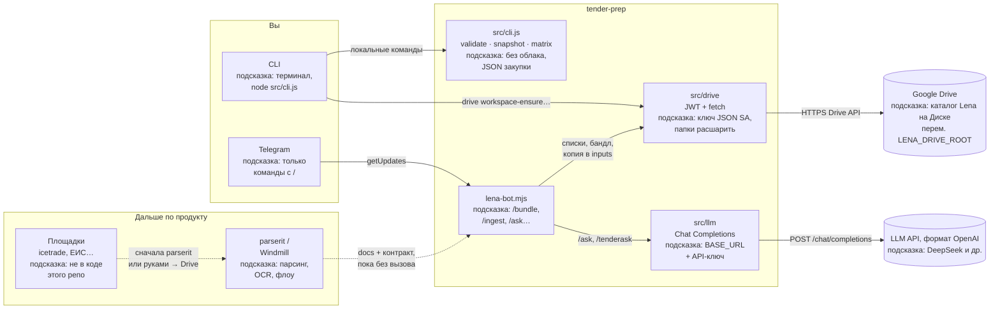

# tender-prep · сервис «Лена»

Репозиторий подготовки тендерных материалов и сценариев вокруг сервиса **«Лена»**: сбор контекста закупки, структурирование входных данных и (опционально) связка с пайплайнами парсинга в Windmill (пространство **parserit**). **В коде уже есть** локальный модуль, **Google Drive** (REST + JWT), **Telegram-бот** и тонкий вызов **LLM**; **вызовы Windmill/parserit** пока не подключены — только описаны в `docs/`.

## Документация

| Файл | Назначение |
|------|------------|
| [docs/PRODUCT_CONTEXT.md](docs/PRODUCT_CONTEXT.md) | Продуктовый контекст: для кого Лена, границы ответственности, сущности и термины |
| [docs/PARSERIT_INTEGRATION.md](docs/PARSERIT_INTEGRATION.md) | Интеграция с parserit: пути скриптов/флоу в Windmill, входы/выходы, типовой порядок вызовов |
| [docs/WINDOWS_GIT.md](docs/WINDOWS_GIT.md) | Работа с Git на Windows для этого репозитория и смежных проектов |
| [docs/GOOGLE_DRIVE.md](docs/GOOGLE_DRIVE.md) | Google Drive: сервисный аккаунт, команды CLI `drive` |
| [docs/GOOGLE_DRIVE_GCP_SETUP.md](docs/GOOGLE_DRIVE_GCP_SETUP.md) | Пошагово: GCP, включение Drive API, ключ, шаринг папки, проверка из Node |
| [docs/TELEGRAM.md](docs/TELEGRAM.md) | Тестовая группа в Telegram и смоук-бот (Bot API) |
| [docs/CORPUS_AND_RAG.md](docs/CORPUS_AND_RAG.md) | Корпус прошлых тендеров на Drive: инвентаризация, контекст, векторный RAG (план) |
| [docs/RAG_VECTOR_PIPELINE.md](docs/RAG_VECTOR_PIPELINE.md) | RAG: чанки, эмбеддинги, векторное хранилище, контракт запроса, порядок внедрения |
| [docs/LENA_CONTEXT_STRATEGY.md](docs/LENA_CONTEXT_STRATEGY.md) | Два слоя контекста: долгий архив vs короткие директивы; приоритет в промпте |
| [docs/LENA_RULES.md](docs/LENA_RULES.md) | Правила поведения Лены для LLM, IDE-агентов и операторов |

Перед изменениями в коде или промптах агентов имеет смысл начинать с **PRODUCT_CONTEXT** и **LENA_RULES**, затем сверяться с контрактом **parserit**, при работе с Диском (в т.ч. `_lena/org-docs`, `_lena/founding-docs`) — с **GOOGLE_DRIVE**, для корпуса тендеров и RAG — с **CORPUS_AND_RAG**, для стратегии контекста Лены — **LENA_CONTEXT_STRATEGY**, для тестов в мессенджере — **TELEGRAM**, с Git на Windows — **WINDOWS_GIT**.

## Что сделано и что впереди

Ниже — схема текущей связки и того, что пока **вне репозитория** или только в документации.



### Пояснение к блокам схемы

- **Вы → CLI** — вы запускаете команды в терминале (`node src/cli.js …`). Это вход без Telegram: проверка JSON, работа с Диском и т.д.
- **Вы → Telegram** — вы пишете боту в личке или группе **команды** с `/` (например `/bundle`, `/ingest`). Обычный текст без `/` бот не обрабатывает.
- **src/cli.js (validate · snapshot · matrix)** — локальная логика без облака: проверка структуры входа закупки и результата парсера, построение снимка и матрицы соответствия по уже готовому JSON парсера.
- **src/drive (JWT + fetch)** — доступ к **Google Drive** от имени **сервисного аккаунта**: списки папок, создание структуры `_lena/`, копирование файлов, выгрузка «бандла» для агента. Без отдельной npm-библиотеки `googleapis`: только HTTPS и ключ JSON.
- **lena-bot.mjs** — процесс бота в Telegram: принимает команды, вызывает модуль Drive и при необходимости **LLM**, отвечает в чат.
- **src/llm (Chat Completions)** — один HTTP-запрос к API в формате, совместимом с OpenAI (подходит **DeepSeek** и другие провайдеры через `LENA_OPENAI_BASE_URL`). Нужен ключ в переменных окружения.
- **Google Drive** — ваше облачное хранилище: корневая папка проекта, внутри `_lena/templates`, `context`, `tenders/…/inputs` и т.д. К папкам должен быть доступ у **email сервисного аккаунта** из ключа.
- **LLM API** — внешний сервис нейросети (например DeepSeek или OpenAI). Бот отправляет туда текст запроса; ответ возвращается в Telegram. Содержимое PDF с Диска само по себе **не читается** моделью, если вы явно не передаёте текст или список/фрагменты в запросе.
- **parserit / Windmill (пунктир)** — задуманное место **тяжёлого парсинга**: скачивание с площадок, OCR, нормализация в JSON. В этом репозитории пока только **документация** и контракт, вызовов из кода нет.
- **Площадки icetrade, ЕИС… (пунктир)** — внешние сайты закупок. Прямой автоматический забор документов по ссылке **не реализован** в `tender-prep`; цепочка идёт через отдельный загрузчик или **parserit**, после чего файлы можно хранить на Drive и использовать **`/ingest`** или CLI.

**Уже в коде**

| Область | Что есть |
|---------|----------|
| Локально | Валидация входа/результата парсера, снимок, матрица (`node src/cli.js …`) |
| Google Drive | `workspace-ensure`, списки шаблонов/контекста, `agent-bundle`, структура `_lena/…`, `corpus-*`, **`rag`** (локальный индекс текста) |
| Telegram | Бот: `/templates`, `/context`, `/library`, `/bundle`, `/ingest` (копия из папки Drive → `inputs`), `/ask`, `/tenderask`, `/newchat`, `/help` |
| LLM | OpenAI-compatible HTTP (`LENA_OPENAI_*` / `OPENAI_API_KEY`), без SDK |

**Пока не в коде этого репо**

- Вызовы флоу **parserit** в Windmill (описано в [docs/PARSERIT_INTEGRATION.md](docs/PARSERIT_INTEGRATION.md)).
- Автозагрузка с **icetrade / ЕИС** по одной ссылке (нужен отдельный загрузчик или parserit, затем при желании файлы на Drive и уже `/ingest`).

## Базовый сценарий end-to-end

Ниже — **минимальный путь** от пустой папки на Google Drive до проверки тендера в Telegram и локальной матрицы. Парсинг площадок и Windmill **не входят** в этот путь (их можно подключить позже).

### Предпосылки

- Установлен **Node.js 20+**, клонирован репозиторий `tender-prep`.
- В Google Cloud создан проект, включён **Drive API**, скачан JSON **сервисного аккаунта** ([docs/GOOGLE_DRIVE_GCP_SETUP.md](docs/GOOGLE_DRIVE_GCP_SETUP.md)).
- В Drive есть **корневая папка** под проект Лены; к ней (и позже к папкам с документами закупки) выдан доступ по **email сервисного аккаунта** из JSON.
- В Telegram создан бот (**@BotFather**), токен известен; при необходимости настроены ключ **LLM** (например DeepSeek) — см. [docs/TELEGRAM.md](docs/TELEGRAM.md).

### Шаг 1. Создать дерево `_lena/` на Диске (один раз на корень)

В терминале (переменная `GOOGLE_DRIVE_CREDENTIALS` — путь к JSON):

```bash
node src/cli.js drive workspace-ensure "<URL или id корневой папки>"
```

Ожидаемый результат: под корнем появляются `_lena/templates`, `_lena/context`, `_lena/library`, `_lena/tenders` (и при необходимости вложенность по годам для тендеров — см. [docs/GOOGLE_DRIVE.md](docs/GOOGLE_DRIVE.md)).

### Шаг 2. Наполнить «статику» Лены

В веб-интерфейсе Google Drive вручную:

- положить **бланки и шаблоны** в `_lena/templates`;
- положить **правила компании, чек-листы, контекст** в `_lena/context`;
- при необходимости — **индекс архива** прошлых тендеров: `drive archive-context-build` (см. [docs/GOOGLE_DRIVE.md](docs/GOOGLE_DRIVE.md#lena-long-memory-archive) и [docs/LENA_CONTEXT_STRATEGY.md](docs/LENA_CONTEXT_STRATEGY.md));
- при необходимости — справочники в `_lena/library`.

Чтобы **увидеть сводку по всем папкам тендеров** уже на Диске (год, имя, сколько файлов в `inputs`/`drafts`/…), локально выполните `node src/cli.js drive tenders-inventory "<корень>"` и сохраните JSON — см. [docs/CORPUS_AND_RAG.md](docs/CORPUS_AND_RAG.md).

### Шаг 3. Завести тендер и положить **входы** закупки

Выберите стабильный **`tender_id`** (например `gs-retail-2026-001`).

**Вариант A — документы уже лежат в отдельной папке на Drive** (папка расшарена на тот же сервисный аккаунт):

1. Запустите бота (см. шаг 5) и в Telegram выполните:  
   `/ingest <tender_id> <ссылка_на_папку_Drive>`  
   либо с годом: `/ingest <tender_id> 2026 <ссылка>`.  
   Файлы из корня папки скопируются в `_lena/tenders/<год>/<tender_id>/inputs`.

**Вариант B — без `/ingest`:** вручную перетащить файлы закупки в папку `inputs` этого тендера (её можно создать, один раз вызвав например `drive agent-bundle` или `/bundle` — дерево тендера создаётся при первом обращении).

Документы с **внешних площадок** (icetrade и т.д.) в этот сценарий попадают **только после ручной выгрузки** (или будущего parserit) в файлы на Диск.

### Шаг 4. Проверить связку «Диск ↔ идентификатор тендера»

**Через CLI:**

```bash
node src/cli.js drive agent-bundle "<корень_Lena>" "<tender_id>"
```

**Через Telegram** (тот же корень в `LENA_DRIVE_ROOT` у процесса бота):

- `/templates`, `/context`, `/library` — видны ли шаблоны и контекст;
- `/bundle <tender_id>` — в чат придёт JSON **agent-bundle** со ссылками на папки тендера и списки файлов.

### Шаг 5. Запустить бота и нейросеть (опционально)

В одном окне терминала задайте переменные (`TELEGRAM_BOT_TOKEN`, `LENA_DRIVE_ROOT`, `GOOGLE_DRIVE_CREDENTIALS`, при необходимости `LENA_OPENAI_*`) и выполните:

```bash
node src/telegram/lena-bot.mjs
```

В группе или личке:

- `/help` — список команд;
- `/tenderask <tender_id> ваш вопрос` — вопрос к модели с усечённым бандлом в контексте;
- `/ask …` — общий вопрос (краткая память в чате; сброс `/newchat`).

Один запущенный экземпляр бота на токен (иначе конфликт `getUpdates`).

### Шаг 6. Локальная матрица (если уже есть JSON результата парсера)

Когда появится файл результата парсера (из parserit или вручную), без Диска:

```bash
node src/cli.js validate-result path/to/parser-result.json
node src/cli.js snapshot path/to/parser-result.json out/snapshot.json
node src/cli.js matrix path/to/parser-result.json out/matrix.json
```

Это **конец базовой цепочки** для текущего кода: структура на Drive, входы тендера, бандл для агента/бота, опционально LLM в Telegram и матрица по JSON парсера.

### Что логично дальше (не в этом сценарии)

- Подключить **parserit**: загрузка и разбор комплекта документов, затем те же папки Drive и команды Лены.
- Автозапуск бота как службы, ограничение чатов `TELEGRAM_ALLOWED_CHAT_IDS`, доработки под ваш регламент.

## Кратко о «Лене»

**Лена** — сервис (или роль агента) **как специалист по подготовке тендерных документов**: сама формирует пакет материалов заявки (требования, матрица, черновики разделов); в чате с командой при необходимости только уточняет входные данные. Тяжёлый разбор документов и унификация структуры выполняются во внешних задачах **parserit** в Windmill; этот репозиторий хранит правила, контекст продукта и сценарии подготовки, а не обязательно сам рантайм Windmill.

## Локальный модуль (без Windmill)

Нужен **Node.js 20+**. Сборка не требуется.

```bash
node src/cli.js validate-input examples/tender-input.sample.json
node src/cli.js validate-result examples/parser-result.sample.json
node src/cli.js snapshot examples/parser-result.sample.json out/snapshot.json
node src/cli.js matrix examples/parser-result.sample.json out/matrix.json
```

Команды **validate / snapshot / matrix** не тянут внешние пакеты. **Google Drive** в CLI работает через встроенный **`fetch`** и JWT (отдельный `npm install` не нужен): задайте `GOOGLE_DRIVE_CREDENTIALS` и см. [docs/GOOGLE_DRIVE.md](docs/GOOGLE_DRIVE.md):

```bash
node src/cli.js drive workspace-ensure "<url_или_id_корневой_папки>"
```

Либо: `npm run lena -- validate-input …` (скрипт вызывает тот же `node src/cli.js`).

Исходники: `src/` — валидация JSON, снимок, матрица; `src/drive/` — Drive API по HTTPS (`authToken.js`, `driveHttp.js`). Точка для Windmill/parserit остаётся внешней.

## Структура репозитория

- `docs/` — человекочитаемый контракт и контекст (в т.ч. для ИИ-агентов).
- `src/` — реализация «Лены» (валидация JSON, снимок, матрица) и опционально `src/drive/`.
- `examples/` — примеры входа закупки, результата парсера и шаблон переменных для Диска.

## Лицензия и доступ

Уточняются владельцем репозитория. Доступ к Windmill и namespace `parserit` выдаётся отдельно от доступа к Git. Ключ сервисного аккаунта Google не хранить в репозитории (см. `secrets/` в `.gitignore`).
